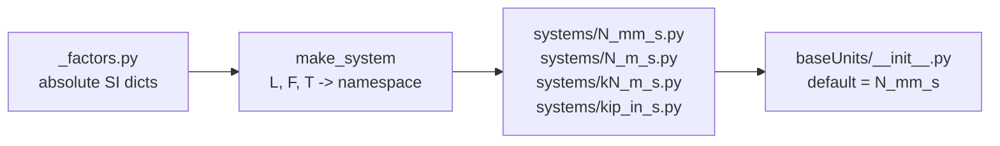

# Architecture

The package has four layers, each doing one job.



## `_factors.py` — single source of truth

Plain `dict`s mapping unit name to its absolute SI value:
`LENGTH` in metres, `FORCE` in newtons, `MASS` in kilograms, `TIME` in
seconds, `PRESSURE` in pascals, and so on. Adding a new unit is a one-line
change here; every consistent system picks it up at build time.

## `make_system(length, force, time)` — the factory

Given primitive names from `_factors`, the factory computes the system's
base SI values:

```
M  = F * T**2 / L      # mass derived
P  = F / L**2          # pressure
E  = F * L             # energy
Pw = E / T             # power
D  = M / L**3          # density
UW = F / L**3          # unit weight
```

Then each named unit's value in the system is `absolute_SI / base_SI`.
**Mass is derived, not chosen.** Picking mass independently would over-
constrain the system and break Newton's second law.

The result is a `types.SimpleNamespace` of float attributes plus
`g` (gravity in this system) and `BASE` (a human-readable label).

## `systems/<name>.py` — pre-built systems

Each module calls `make_system` once and re-exports the namespace at module
scope via `globals().update(_ns.__dict__)`, so `from baseUnits.systems.kip_in_s
import *` puts every named float in the caller's scope.

Available out of the box: `N_mm_s`, `N_m_s`, `kN_m_s`, `kip_in_s`.

## Top-level package

`baseUnits/__init__.py` re-exports the default system (`N_mm_s`) at the top
level, alongside the `systems` and `checked` submodules. `import baseUnits as
u` is the canonical entry point.

## Tradeoffs vs. wrapper-object libraries

Compared to `pint`, `astropy.units`, or `unyt`: this library is
deliberately *less* safe at runtime. There is no `Quantity` object guarding
your arithmetic; you can add a force to a length and it will not complain.
The benefit is that every value is a normal `float` (or `numpy` scalar), so
the rest of your scientific stack — numpy broadcasting, pandas columns,
matplotlib plots, FEM solver bindings — sees ordinary numbers and stays at
full speed.

The opt-in `baseUnits.checked` layer trades that speed back for runtime
dimensional safety when you want it (development, validation, tests). Use
each layer where it pays.
